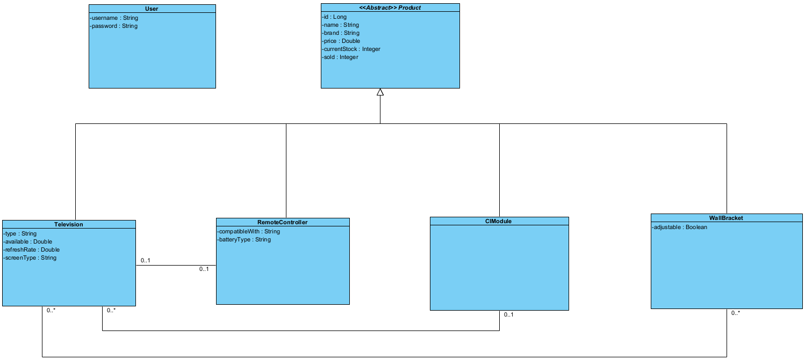

## Inleiding
In de les hebben we het gehad over werken met databases. Als het goed is, heb je de stof van de cursus Database Development op EdhHub gelezen en geoefend met de lesopdracht. Zo niet, dan raden we je aan om dat eerst te doen, voor je met de opdracht begint.  

## Opdrachtbeschrijving
We borduren voort op de vorige huiswerkopdracht, namelijk de [TechItEasy](https://github.com/hogeschoolnovi/hogeschoolnovi-backend-technisch-ontwerp-klassendiagram ) opdracht. We gaan het gemaakte klassendiagram omzetten naar een daadwerkelijke database voor de TechItEasy app. Je mag je eigen klassendiagram gebruiken of het klassendiagram uit de voorbeeld uitwerkingen.

## Randvoorwaarden
De opdracht moet voldoen aan de volgende voorwaarden:

- alle klassen van het klassendiagram moeten vertaald zijn naar tabellen;
- alle relaties moeten vertaald zijn naar de juiste tabellen;
- alle tabellen moeten de juiste attributen bevatten als kolommen;
- de kolommen moeten voorzien zijn van de juiste constricties (beperkingen).
- de database moet gevuld zijn met data.
- de data wordt opgehaald uit de database.

### Product
Je levert het .sql bestand in waar al je queries in staan.

## Stappenplan
Let op: het is uitdagender om jouw eigen stappenplan te maken. Als je niet zo goed weet waar je moet beginnen, kun je onderstaand stappenplan gebruiken.

1. Maak een database voor de TechItEasy app.

2. Je gaat voor elke klas een tabel maken. Bedenk hoe die tabel er uit komt te zien.

3. Zorg dat je zeker weet dat de tabel die we gaan maken nog niet bestaat, oftewel, verwijder de tabel als hij al bestaat.

4. Maak één voor één de tabellen aan die nodig zijn.

5. Geef elke tabel de juiste kolommen met restricties.

6. Leg de relaties tussen je tabellen.

7. Vul je database met data. (De exacte inhoud hier van mag je zelf bedenken)

8. Gebruik select statements om je data op te halen.

(let op dat er geen onnodige informatie in de tabel staat).

## Bonusopdrachten
Als je de bonusopdrachten maakt, zorg dan dat deze ook getest worden!

1. Verzin meerdere nieuwe klassen met relaties en vertaal deze naar tabellen.

2. Probeer een database in te richten voor je eigen eindopdracht.

